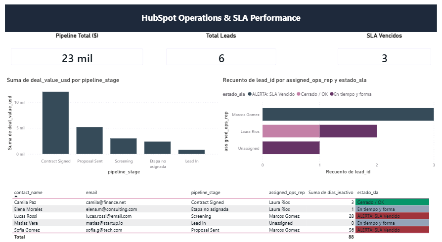

# 📊 CRM Data Pipeline & SLA Automation (Ops & Data)

> **Automated ETL pipeline in Python and executive reporting in Power BI for HubSpot CRM operational data.**  
> *Pipeline automatizado de ETL en Python y reportería ejecutiva en Power BI para datos operativos de HubSpot CRM.*

---

## 🇺🇸 

### 🎯 Business Objective
Streamline operational workflows from HubSpot CRM data by eliminating manual cleaning tasks, detecting duplicate lead records, and monitoring operational SLA compliance across team members.

### 🛠️ Tech Stack & Methods
- **Python:** Pandas, OS, Datetime (Automated data sanitization, schema standardization, and rule-based alerting).
- **ETL & Data Quality:** Automated CSV ingestion, duplicate detection, and structured data export.
- **Business Intelligence:** Power BI Desktop (Interactive KPI tracking, bottleneck detection, and rep workload balance).

### 📈 Business Impact
- **Zero Manual Reprocessing:** Instantaneous and consistent record formatting.
- **Data Integrity:** 100% automated detection of duplicate contacts in pipeline.
- **Proactive Bottleneck Flagging:** Automated SLA breach alerts for deals exceeding 10 days of inactivity.

---

## 🇪🇸 

### 🎯 Objetivo de Negocio
Optimizar el flujo de datos operativos provenientes de HubSpot CRM, eliminando tareas manuales de limpieza, identificando duplicados en el pipeline de ventas y monitoreando el cumplimiento de SLAs de atención operativa.

### 🛠️ Tecnologías y Métodos
- **Python:** Pandas, OS, Datetime (Sanitización de datos, estandarización de esquemas y alertas basadas en reglas).
- **ETL y Calidad de Datos:** Ingesta automatizada de CSVs, detección de duplicados y exportación estructurada.
- **Business Intelligence:** Power BI Desktop (Seguimiento interactivo de KPIs, detección de cuellos de botella y control de carga por operador).

### 📈 Impacto Operativo
- **Eliminación del reproceso manual:** Limpieza instantánea y consistente de registros.
- **Calidad de datos:** Identificación automática del 100% de duplicados en la base de contactos.
- **Detección temprana:** Alertas automáticas para registros con más de 10 días de inactividad en el pipeline.
